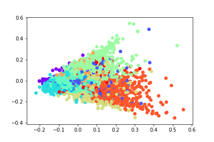

# 文档相似度

## 数据预处理
1. 读取数据
2. 分词处理 cut word
3. 停用词处理 stop word
4. 制作字典库 dictionary
5. 制作语料库 corpus

## 原理(先占个位置......)
1. TF-IDF
2. LSI
3. Doc2Vec-DM
4. Doc2Vec-DBOW

## 效果
Q:"射雕英雄传中谁的武功天下第一"

A:LSI 效果最好,TF-IDF 次之.而 Doc2Vec 模型无法正确提取关键信息,甚至牛头不对马嘴.

### TF-IDF
```
1061 0.25669920444488525 第五回　弯弓射雕(1)
1172 0.25669920444488525 第五回　弯弓射雕(2)
3880 0.20211602747440338 郭靖涨红了脸，答道：“我想，王真人的武功既已天下第一，他再练得更强，仍也不过是天下第一。我还想，他到华山论剑，倒不是为了争天下第一的名头，而是要得这部《九阴真经》。他要得到经书，也不是为了要练其中的功夫，却是相救普天下的英雄豪杰，教他们免得互相所杀，大家不得好死。”
2880 0.18251502513885498 武功天下第一的王真人已经逝世，剩下我们四个大家半斤八两，各有所忌。
8377 0.18021109700202942 你上得华山来，妄想争那武功天下第一的荣号，莫说你武功未必能独魁群雄，纵然是当世无敌，天下英雄能服你这卖国好徒么？”
```

### LSI
```
2880 0.6837087869644165 武功天下第一的王真人已经逝世，剩下我们四个大家半斤八两，各有所忌。
7965 0.646489679813385 两人回到帐中，这番当真研习起《九阴真经》上的武功来，谈论之下，均觉对方一年来武功大有长进，均感欣慰。
8377 0.6456590890884399 你上得华山来，妄想争那武功天下第一的荣号，莫说你武功未必能独魁群雄，纵然是当世无敌，天下英雄能服你这卖国好徒么？”
2626 0.5858802199363708 丘处机道：“韩女侠，天下武学之士，肩上受了这样的一扳，若是抵挡不住，必向后跌，只有九指神丐的独家武功，却是向前俯跌。只因他的武功刚猛绝伦，遇强愈强。穆姑娘受教时日虽短，却已习得洪老前辈这派武功的要旨。她抵不住王师弟的一扳，但决不随势屈服，就算跌倒，也要跌得与敌人用力的方向相反。”
5277 0.5856705904006958 武术中有言道：”未学打人，先学挨打。”初练粗浅功夫，却须由师父传授怎生挨打而不受重伤，到了武功精深之时，就得研习护身保命、解穴救伤、接骨疗毒诸般法门。须知强中更有强中手，任你武功盖世，也难保没失手的日子。这《九阴真经》中的“疗伤篇”，讲的是若为高手以气功击伤，如何以气功调理真元，治疗内伤。至于折骨、金创等外伤的治疗，研习真经之人自也不用再学。
```

### Doc2Vec-DM
```
1158 0.8241669535636902 正自怔怔出神，突然听到华筝的声音在后叫道：”郭靖，快来，快来！”
2608 0.8154236674308777 郭靖在赵王府中见过包惜弱的居所，听到这里，心下已是恍然。
2441 0.8090466260910034 郭靖听得语声，心中大喜，叫道：“师父，快救弟子！”
7378 0.8052639365196228 第三十五回　铁枪庙中(1)
6354 0.8042024970054626 两人走入林中，郭靖将黄蓉背起，仍由她指点路径，一步步的向外走去。
```

### Doc2Vec-DBOW
```
5177 0.9147704839706421 宫内带刀护卫巡逻严紧，但周、郭、黄轻身功夫何等了得，岂能让护卫发见？洪七公识得御厨房的所在，低声指路，片刻间来到了六部山后的御厨。
3014 0.9035613536834717 这词黄蓉曾由父亲教过，知道是岳飞所作的《小重山》，又见下款写着“五湖废人病中涂鸦”八字，想来这“五湖废人”必是那庄主的别号了。但见书法与图画中的笔致波磔森森，如剑如戟，岂但力透纸背，直欲破纸飞出一般。
4405 0.9006547331809998 他武功既强，眼力又高，搜罗的奇珍异宝不计其数，这时都供在亡妻的圹室之中。黄蓉见那些明珠美玉、翡翠玛瑙之属在灯光下发出淡淡光芒，心想：
1240 0.8996094465255737 那道人道：“睡觉之前，必须脑中空明澄澈，没一丝思虑。然后敛身侧卧，鼻息绵绵，魂不内荡，神不外游。”当下传授了呼吸运气之法、静坐敛虑之术。
2428 0.8995554447174072 郭靖道：“眼不视而魂在肝、耳不闻而精在肾、舌不吟而神在心、鼻不香而魄在肺、四肢不动而意在脾，是为五气朝元。”
```

### 关键词提取
```
聚类关键词:
Cluster 0: 铁木真 | 札木合 | 桑昆 | 哲别 | 王罕 | 蒙古 | 拖雷 | 儿子 | 豹子 | 博尔 |
Cluster 1: 黄蓉道 | 爹爹 | 郭靖道 | 黄蓉 | 郭靖 | 欧阳锋 | 靖哥哥 | 知道 | 说道 | 伯伯 |
Cluster 2: 欧阳克 | 彭连虎 | 梁子翁 | 侯通海 | 沙通天 | 黄蓉 | 武功 | 一声 | 众人 | 程瑶迦 |
Cluster 3: 丘处机 | 完颜康 | 穆念慈 | 贫道 | 王处一 | 道长 | 杨铁心 | 说道 | 柯镇恶 | 一声 |
Cluster 4: 说道 | 柯镇恶 | 周伯通 | 不是 | 梅超风 | 不知 | 一声 | 武功 | 心中 | 知道 |
Cluster 5: 郭靖 | 黄蓉 | 心中 | 说道 | 一声 | 不知 | 拖雷 | 裘千仞 | 欧阳锋 | 周伯通 |
Cluster 6: 黄药师 | 欧阳锋 | 郭靖 | 桃花岛 | 周伯通 | 女儿 | 说道 | 武功 | 功夫 | 一声 |
Cluster 7: 只见 | 两人 | 黄蓉 | 郭靖 | 心中 | 正是 | 突然 | 地下 | 一声 | 众人 |
Cluster 8: 洪七公 | 欧阳锋 | 叫化 | 郭靖 | 黄蓉 | 周伯通 | 老毒物 | 说道 | 功夫 | 武功 |
Cluster 9: 师父 | 六位 | 郭靖 | 弟子 | 说道 | 黄蓉 | 心中 | 郭靖道 | 柯镇恶 | 洪七公 |
聚类分布:
{4: 3632, 7: 672, 3: 511, 5: 1192, 1: 421, 0: 207, 9: 358, 6: 479, 2: 486, 8: 653}
聚类距离:
0.9358709112276515
```

### 降维可视化


